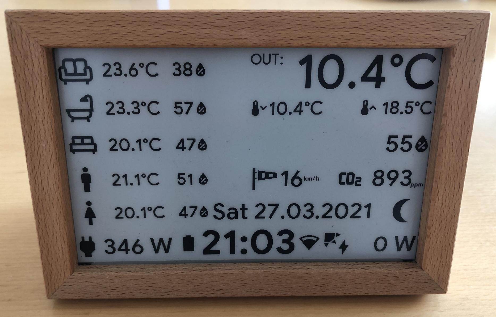
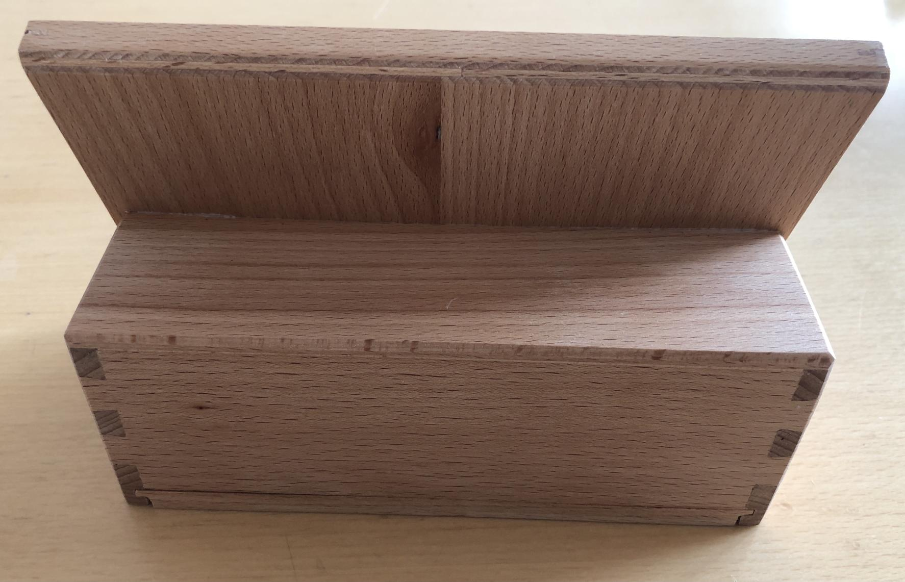
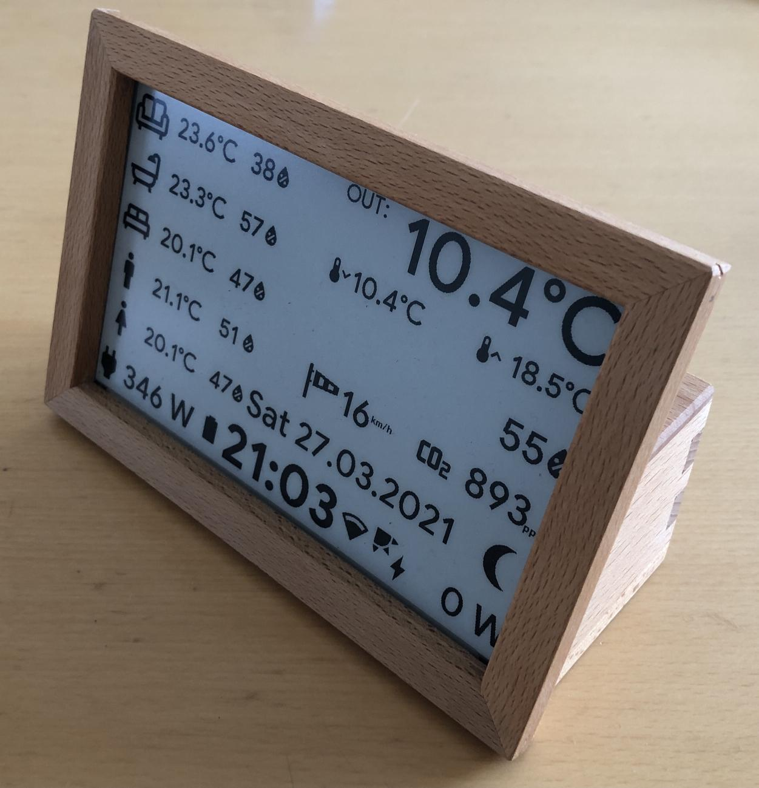
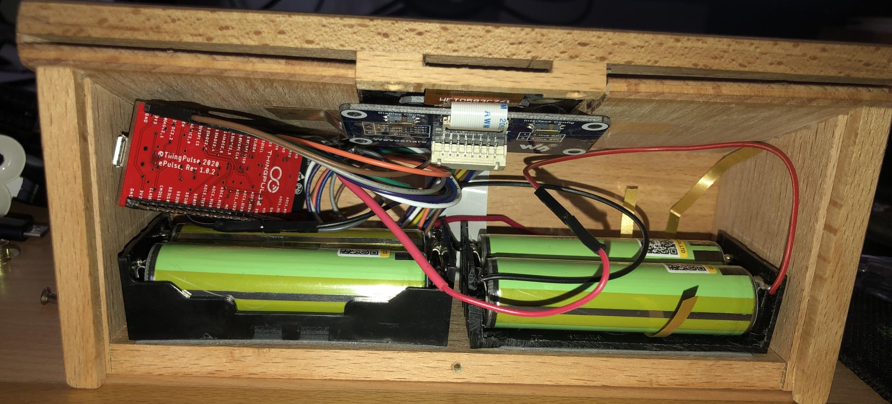

# ESP32 based E-Paper Display to display Smart Home Data


<p align="center"> </p>
<p align="center">  </p>

This is the documentation of my self-build ESP32 based E-Ink Display for displaying Smart Home Data. All of this is heavily inspired on this thread: https://community.home-assistant.io/t/e-paper-display/138625/92

But as I am a OpenHAB user, it is all based on MQTT, and this is still work in progress...

Used Hardware:
- Custom build wooden Case (thanks to my father!)
- [Thingpulse ePulse – Low Power ESP32 development board](https://thingpulse.com/product/epulse-low-power-esp32-development-board/) 
- [Waveshare 7.5inch e-Paper HAT](https://www.waveshare.com/wiki/7.5inch_e-Paper_HAT)
- 3 x [18650 Battery Holder](https://www.aliexpress.com/item/4000066839172.html)
- 6 x [Liitokala 18650 3400mAh Li-Ion NCR18650B rechargeable Li-lon](https://www.aliexpress.com/item/32362625564.html)
- 1 x 220 kOhm resistor (for the voltage divider)
- 1 x 100 kOhm resistor (for the voltage divider)

The battery holders are connected in serial, so that we have an output voltage of 8.4 V max and 5 V min, to monitor battery level i build a voltage divider:
- Input 8.4 V
- R1 = 220kOhm
- R2= 100kOhm
- Out: 2.625V

*...i need to optimize the power consumption, because this whole setup is only running for about 30 days, with 4x3400mA Batteries!!... still investigating this...*

Used Software:
- GIMP: to do the layout (see Gimp_Prototype.xcf)
- [ESPHome](https://esphome.io/index.html)
- [OpenHAB](https://www.openhab.org/) you find the needed rules in openhab/esp32epaper.rules (needs JSScripting)
- you find my code in this repository
- the BLE part is disabled, because of memory problems...

To correctly compile this you have to create a secrets.yaml file within the root directory of the project with the following content:
```console
wifi_ssid: "yourssid"
wifi_password: "yourpassword"
api_password: "yourpassword"
ota_password: "yourpassword"
mqtt_host: 192.168.1.111
mqtt_user: mqttuser
mqtt_password: mqttpassword
```
